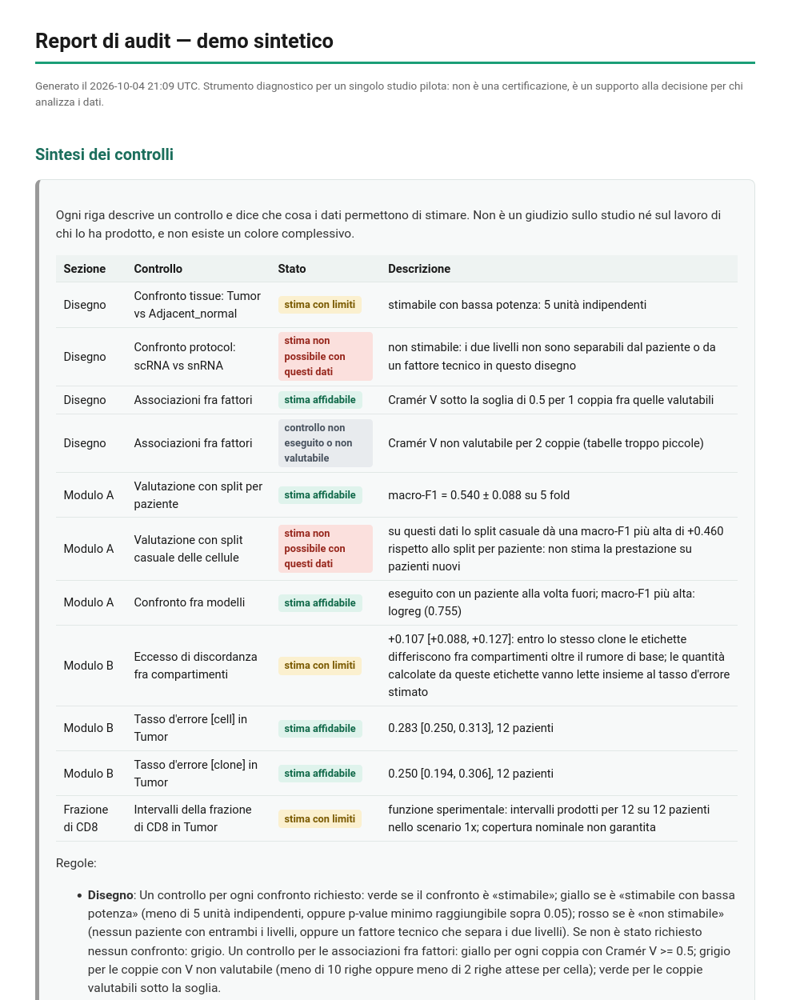

# genomic-audit

## In breve

`genomic-audit` è uno strumento di controllo per studi di trascrittomica a singola cellula su
coorti cliniche piccole. È pensato per i laboratori che lavorano con coorti di 10–100 pazienti e
dati single-cell. Affronta tre problemi:
1. **disegno sperimentale e confondimento**: quali confronti il disegno permette davvero di
   stimare, e con quanti pazienti indipendenti;
2. **accuratezza gonfiata** quando le cellule di uno stesso paziente finiscono sia nel training
   sia nel test di un classificatore;
3. **affidabilità delle annotazioni delle cellule T**, verificata con il TCR come riferimento
   indipendente dal clustering.

Gira **solo in locale**: nessun dato lascia la macchina, non ci sono account né servizi esterni.
È un controllo riutilizzabile, mai un verdetto sul lavoro di un gruppo; ed è un prototipo per
uno studio pilota, non uno strumento certificato.

## Avvio rapido

Serve Python 3.12 o successivo. Con [uv](https://docs.astral.sh/uv/):

```bash
uv sync --extra dev                                         # installa
uv run python cli.py demo --out results/demo_report.html    # demo: report HTML autocontenuto
uv run pytest                                               # suite di test
```

Senza uv, con `venv` e `pip`:

```bash
python3 -m venv .venv && source .venv/bin/activate && pip install -e ".[dev]"
python cli.py demo --out results/demo_report.html
pytest
```

Entrambe le strade sono state provate su un clone pulito della repo pubblica
(`docs/sviluppo/logs/installazione_pulita.txt`): la demo impiega circa 3 minuti, la suite fra 11
e 16 minuti su 12 core (i test di calibrazione simulano centinaia di repliche). Esito della
suite attuale: `115 passed, 2 xfailed` (`docs/sviluppo/logs/pytest_rifinitura.txt`). I 2 `xfail`
sono calibrazioni conservative note e dichiarate (vedi [Test](#test)). I 3 test di
`tests/test_real_data_gse278694.py` richiedono i dati di GSE278694, che la repo non include:
senza quei dati vengono saltati, e l'esito atteso è `112 passed, 3 skipped, 2 xfailed`.

Per l'interfaccia web locale: `uv run audit-sc serve` (oppure `audit-sc serve` nel venv), che
apre `http://localhost:8501`.

## Risultati su dati pubblici

Tre estratti di output reali dello strumento. I file completi sono nella repo, ai percorsi
indicati.

**1. Audit del disegno — GSE278694** (adenocarcinoma duttale pancreatico; Chen et al.,
*Cancer Cell* 2025). Sui metadati reali (37 librerie, 22 pazienti) il confronto fra protocolli
scRNA-seq e snRNA-seq non è stimabile, perché nessun paziente è stato misurato con entrambi
(`validation/results/cli_design_real.txt`):

```
Confronto 'protocol': scRNA vs snRNA: non stimabile -- nessun paziente ha entrambi i livelli: la
differenza fra 'scRNA' e 'snRNA' coincide con la differenza fra due gruppi di pazienti diversi
(fattore confuso con il paziente). Unità indipendenti: 0; p-value minimo non definito (nessun
test possibile).
```

**2. Modulo A — GSE125449** (tumori primitivi del fegato; Ma et al., *Cancer Cell* 2019;
9.946 cellule, 19 pazienti, 8 tipi cellulari). Lo split casuale delle cellule dà una macro-F1
più alta di 0,117 rispetto allo split per paziente
(`validation_esterna/results/A1_cli_stdout.txt`):

```
Split per paziente (valutazione onesta): macro-F1 = 0.778 ± 0.060 su 5 fold. Split casuale sulle
cellule (controllo negativo, NON una valutazione valida perché mette cellule dello stesso
paziente sia in train sia in test): macro-F1 = 0.895 ± 0.004. Divario sulla media: +0.117 -- lo
split casuale sovrastima l'accuratezza reale del modello di circa 0.117 punti di macro-F1.
```

**3. Modulo B — GSE278694.** Il tasso d'errore dell'annotazione delle cellule T nel tumore,
rispetto all'identità del clone stimata nel sangue, con le due convenzioni affiancate. La
convenzione «per clone» riproduce i numeri della tesi da cui il progetto nasce (0,1951, IC 95%
[0,1230; 0,2737]); quella «per cellula» dà 0,093 sugli stessi dati
(`validation/results/cli_tcr_real_conventions_tesi.txt`):

```
[cell] per cellula: ogni cellula giudicata è un'unità; etichette fuori dalla mappa dei marcatori
escluse -- 'Tumor': 0.093 (IC95% [0.050, 0.144], 10 pazienti).
[clone] per clone: un'unità per coppia clone-compartimento con almeno 3 cellule, etichetta di
maggioranza; etichette fuori mappa contate come errore (etichette ammesse fuori mappa: NK);
positività esclusiva in ordine CD8T > CD4T -- 'Tumor': 0.195 (IC95% [0.123, 0.274], 10
pazienti).
```

I due valori non sono in contraddizione: misurano due cose diverse (cellule contro cloni, con le
etichette NK escluse oppure contate come errore), e per questo lo strumento li riporta sempre
insieme, ciascuno con la sua definizione.

Il report HTML della demo, con la «Sintesi dei controlli» in apertura:



## Validazione

| Dataset | Che cosa è stato verificato | Esito |
|---|---|---|
| [GSE132465](https://www.ncbi.nlm.nih.gov/geo/query/acc.cgi?acc=GSE132465), carcinoma colorettale | audit del disegno, criteri D1-D4, contro uno script indipendente che non importa nulla da `core/` | prima esecuzione: **D2 e D4 falliti** (un difetto nella lettura dei valori mancanti, corretto nel commit `7bb30ca`); dopo la correzione: soddisfatti |
| [GSE131907](https://www.ncbi.nlm.nih.gov/geo/query/acc.cgi?acc=GSE131907), adenocarcinoma polmonare | audit del disegno, criteri D1-D4 | soddisfatti dalla prima esecuzione |
| [GSE125449](https://www.ncbi.nlm.nih.gov/geo/query/acc.cgi?acc=GSE125449), tumori primitivi del fegato | audit del disegno (D1-D4) e Modulo A (A1-A4: esecuzione, verifica indipendente, controllo negativo con 20 permutazioni, robustezza di formato) | disegno: soddisfatti. Modulo A, prima esecuzione: **A1 non terminato dopo 5 h 26 min, A4c fallito**; con il motore riscritto: A1-A4 soddisfatti |
| [GSE278694](https://www.ncbi.nlm.nih.gov/geo/query/acc.cgi?acc=GSE278694), adenocarcinoma pancreatico | Modulo B e audit del disegno sui dati reali; riproduzione dei numeri della tesi | numeri riprodotti (`docs/sviluppo/REPORT_INTERVENTI.md`); non fa parte della validazione esterna |

**Verdetto della validazione esterna, nelle due versioni:** con i criteri originali, scritti
prima di toccare i dati, **NON PRONTO** (prima esecuzione); con i criteri modificati due volte
dopo aver visto i risultati, **PRONTO**. Il testo dei criteri prima e dopo, i motivi e gli esiti
di ogni dataset con entrambe le versioni sono in
[`validation_esterna/REPORT.md`](validation_esterna/REPORT.md).

**Il Modulo B è validato su un solo dataset (GSE278694); la frazione di CD8 è sperimentale.**

## Cosa fa

**Audit del disegno e del confondimento (solo metadati).** Legge una tabella con una riga
per campione o libreria (oppure `adata.obs`, ridotto alle combinazioni distinte dei fattori)
e l'indicazione del ruolo delle colonne: paziente, tessuto, fattori tecnici (libreria,
batch, chimica, protocollo, data), esiti. Riporta:
(1) i fatti strutturali del disegno, rilevati in modo deterministico: annidamenti, fattori
coincidenti, esiti determinati da un fattore, fattori tecnici in corrispondenza 1:1 con la
coppia paziente-tessuto; per ogni coppia di fattori riporta anche il Cramér V con la
correzione di Bergsma, "non valutabile" su tabelle troppo piccole, con allarme a V >= 0.5;
(2) per ogni confronto richiesto, il numero di unità indipendenti (pazienti) e la classe
`stimabile` / `stimabile con bassa potenza` / `non stimabile`.
Funziona anche prima di sequenziare, sul foglio di disegno dei campioni.

**Modulo A -- Audit del leakage per paziente.** Per un task di classificazione a scelta
dell'utente, confronta una valutazione onesta (split a 5 fold raggruppato per paziente,
`StratifiedGroupKFold`) con un controllo negativo (split casuale sulle singole cellule,
che ignora il paziente e quindi lascia "gemelle" della stessa cellula sia in train sia in
test). Il divario fra le due misura quanto una pipeline che non raggruppa per paziente
sovrastimerebbe l'accuratezza e sottostimerebbe l'incertezza. Con almeno 8 pazienti,
ripete il confronto con `LeaveOneGroupOut` su tre modelli (regressione logistica, random
forest, gradient boosting), con la correzione di Nadeau-Bengio (anticonservativa la
versione non corretta, perché i training set dei fold si sovrappongono) e il test di
Wilcoxon appaiato, segnalando quando le due conclusioni divergono.

Motore pensato per dati reali: la matrice resta sparsa; in ogni fold, e stimati sul solo
training, si calcolano log-CPM, i 2.000 geni più variabili e (per random forest e gradient
boosting) 50 componenti SVD. Il training è limitato a 20.000 cellule per fold con
sottocampionamento stratificato per paziente, dichiarato. La macro-F1 è calcolata sulle sole
classi presenti nel fold di test, e le classi assenti sono dichiarate. I fold della
regressione logistica girano in parallelo, con risultati identici a quelli sequenziali.
Tempi misurati su questa workstation (12 core): GSE125449 reale (9.946 cellule, 18.372 geni,
19 pazienti) 6,7 minuti; dati sintetici con 25.000 cellule, 20.000 geni e 20 pazienti 6,2
minuti, misurati prima della parallelizzazione dei fold. In entrambi i casi il confronto fra
modelli è incluso. `--rapido` lo esclude. Mostra anche la stabilità delle spiegazioni
(Jaccard fra i 50 geni principali dei fold), una misura descrittiva.

**Modulo B -- Validazione dell'annotazione via TCR.** Usa il repertorio T-cell receptor
come ancora indipendente dal clustering: se le cellule dello stesso clone T (stessa
sequenza CDR3 della catena TRB) ricevono etichette di tipo cellulare diverse a seconda
del compartimento tissutale in cui si trovano, quell'eccesso di discordanza (oltre il
rumore di base entro compartimento) è un segnale di errore sistematico
nell'annotazione -- tipicamente più frequente nel tessuto tumorale che nel sangue.
L'intervallo di confidenza usa il cluster bootstrap sui PAZIENTI (non sui cloni, che sono
annidati nei pazienti e non sono osservazioni indipendenti). Se fornita una mappa
etichetta -> geni marcatori canonici, calcola anche il tasso d'errore per compartimento
usando come riferimento un solo compartimento (tipicamente il sangue), per evitare la
circolarità di stimare il riferimento sugli stessi dati che poi si giudicano.

**Modulo B -- Convenzioni del tasso d'errore.** Il tasso d'errore rispetto al riferimento
dal sangue è riportato con due convenzioni affiancate, ciascuna con nome e definizione
(`--convention both|cell|clone`, default `both`):
- *per cellula* (etichette fuori mappa escluse);
- *per clone* (un'unità per coppia clone-compartimento con almeno 3 cellule, etichetta di
  maggioranza, etichette fuori mappa contate come errore).

Con `--clone-error-labels NK --clone-marker-priority CD8T,CD4T` la convenzione per clone
riproduce esattamente i numeri della tesi su GSE278694 (tumore 0,1951 contro 0,093 per
cellula). Prima di ogni calcolo il Modulo B riporta la frazione di barcode VDJ ritrovati nei
metadati e normalizza, dichiarandolo, il suffisso "-N" quando serve. Sotto il 50% di match
si ferma con un errore.

**Modulo B -- Flag per cellula.** Con la mappa dei marcatori e il compartimento di
riferimento, il Modulo B scrive in una COPIA dell'AnnData (`<nome>_audited.h5ad`) e in un
CSV due colonne per cellula: `audit_reference_label`, l'identità del clone stimata nel
sangue, e `audit_label_vs_reference`, True/False se l'etichetta assegnata discorda o
concorda. Il valore è `NA` dove la cellula non era verificabile. La media dei flag
valutabili di un compartimento coincide esattamente con il tasso d'errore del Modulo B.

**Modulo B -- Frazione di CD8 con l'errore propagato (SPERIMENTALE).** Per ogni paziente, nel
compartimento scelto: frazione di cellule etichettate CD8 sul totale delle CD4+CD8, e
intervallo plausibile al 95% dopo l'inversione di una matrice di confusione con direzione
(vera CD4/CD8 -> chiamata CD4/CD8/altro), stimata sulle cellule con identità di
riferimento e pooled fra pazienti. Tre scenari di errore sono sempre riportati (0.5x, 1x,
2x), senza indicarne uno come "il risultato". Nessun intervallo con meno di 5 pazienti con
riferimento o con una matrice mal condizionata (J < 0.2, oppure un intervallo di J che
include lo zero).

## Cosa NON fa

- Nessuna autenticazione, nessun utente multiplo, nessuna fatturazione, nessun deployment
  cloud, nessun database persistente. Gira in locale, i dati non lasciano la macchina.
- Non è una validazione biologica indipendente: il Modulo B usa il TCR come ancora, ma
  resta un segnale statistico, non una conferma sperimentale (es. citometria, sorting).
- Con pochi fold (tipico di coorti piccole) la potenza statistica è bassa: "non
  significativo" non vuol dire "equivalente". Lo strumento lo segnala esplicitamente
  invece di nasconderlo.
- Il Modulo B richiede che il dataset abbia una colonna di compartimento tissutale e file
  VDJ Cell Ranger; senza quelli, restano disponibili solo l'audit del disegno e il Modulo A.
- **Audit del disegno:** non guarda l'espressione genica e non stima effetti biologici.
  La scomposizione della varianza su pseudobulk (paziente/tessuto/batch) esiste in
  `core/design_audit.py` ma NON è esposta: la calibrazione del suo intervallo è fuori
  banda per la quota del tessuto (vedi `docs/sviluppo/NOTE.md`). Il Cramér V a soglia 0.5 ha potenza
  0.46 a V = 0.5: un'associazione moderata spesso non viene segnalata. Non verifica che una
  colonna dichiarata come esito sia davvero a livello di paziente.
- **Flag per cellula:** non correggono nulla, e le etichette originali non vengono mai
  modificate. Non esiste un flag dei doppietti: lo fanno già scDblFinder e Scrublet. Le
  cellule senza TCR, i cloni senza cellule sufficienti nel sangue, le etichette fuori dalla
  mappa dei marcatori e le cellule del compartimento di riferimento restano `NA`, e `NA`
  non significa "corretta".
- **Frazione di CD8:** assume che l'identità dal sangue sia corretta e che i cloni
  condivisi con il sangue (quelli espansi) siano rappresentativi dei non condivisi.
  Quest'ultima assunzione non è verificabile: nei dati PDAC originali l'errore cresce con
  la dimensione del clone. La matrice è unica per tutti i pazienti. Doppietti e cellule
  non-T etichettate CD4/CD8 non sono modellati.
  **Nessuno dei tre scenari garantisce la copertura nominale in tutti i casi** (misura B3,
  `tests/test_cd8_robustness.py`, 2000 intervalli per caso, errore asimmetrico CD4->CD8 0.10,
  CD8->CD4 0.03, altro 0.04). Copertura dell'IC 95%:
  - errore dei cloni condivisi uguale a quello degli altri: 0.5x 0.878; 1x 0.944; 2x 0.755;
  - errore dei cloni condivisi doppio: 0.5x 0.923; 1x 0.839; 2x 0.270;
  - errore dei cloni condivisi quadruplo: 0.5x 0.945; 1x 0.285; 2x mai calcolabile.

  Lo scenario che copre il valore vero dipende quindi da quanto i cloni condivisi sono
  rappresentativi, cosa che sui dati non si può verificare. Sui dati reali di GSE278694
  la matrice stimata nel tumore ha P(chiamata CD8 | vera CD4) = 0.45, un errore molto
  più alto di quelli simulati: lì lo scenario 2x non è calcolabile e l'intervallo 1x
  arriva a 0 in 8 pazienti su 13.

## Web app locale (demo con un clic)

```bash
uv run audit-sc serve          # apre http://localhost:8501
```

L'app ascolta solo su `localhost`, con la telemetria di Streamlit disattivata: nessun dato e
nessuna statistica d'uso lasciano la macchina. Nella barra laterale ci sono due modalità:
- **Demo immediata:** un clic carica metadati reali GEO per il disegno e un sottoinsieme
  reale di GSE125449 per il Modulo A (`data/demo/`); il Modulo B usa dati sintetici
  dichiarati;
- **Carica studio:** percorsi locali o upload di CSV/TSV, `.h5ad`, cartelle 10x Matrix
  Market e manifest VDJ.

Le sezioni sono Disegno, Modulo A, Modulo B e «Sintesi dei controlli», esportabile in Markdown o
HTML.

## Sintesi dei controlli (regole del semaforo)


La sintesi (`core/verdict.py`) non è un verdetto sullo studio né sul lavoro di chi lo ha
prodotto. Ogni riga descrive **un controllo** e dice che cosa i dati permettono di stimare. Non
esiste un colore complessivo per sezione o per studio: ogni sezione riporta solo quanti controlli
sono in ciascuno stato. Le regole leggono classi e soglie già calcolate dai moduli, senza nuovi
calcoli.

| Stato | Testo | Significato |
|---|---|---|
| verde | stima affidabile | il controllo è stato eseguito e non segnala limiti |
| giallo | stima con limiti | la stima esiste, ma va letta insieme al limite indicato |
| rosso | stima non possibile con questi dati | i dati non contengono l'informazione necessaria |
| grigio | controllo non eseguito o non valutabile | non richiesto, rifiutato dallo strumento o non valutabile; mai mostrato in verde |

| Sezione | Controllo | Verde | Giallo | Rosso | Grigio |
|---|---|---|---|---|---|
| Disegno | ogni confronto richiesto | classe «stimabile» | «stimabile con bassa potenza»: meno di 5 unità indipendenti, oppure p-value minimo raggiungibile > 0.05 | «non stimabile»: nessun paziente con entrambi i livelli, oppure un fattore tecnico separa i due livelli | nessun confronto richiesto |
| Disegno | associazioni fra fattori | coppie valutabili con Cramér V < 0.5 | una riga per ogni coppia con Cramér V >= 0.5 | — | coppie con V non valutabile (meno di 10 righe o meno di 2 righe attese per cella) |
| Modulo A | valutazione con split per paziente | nessuno dei limiti a destra | classi assenti da almeno un fold di test, training sottocampionato (oltre 20.000 cellule per fold), oppure classificatore non convergente in almeno un fold | — | — |
| Modulo A | valutazione con split casuale delle cellule | divario <= 0.05 | — | divario > 0.05: lo split casuale non stima la prestazione su pazienti nuovi | — |
| Modulo A | confronto fra modelli | eseguito | — | — | non eseguito (meno di 8 pazienti, oppure `--rapido`) |
| Modulo B | eccesso di discordanza fra compartimenti | IC 95% che include lo zero | IC 95% interamente sopra lo zero | meno di 5 pazienti: intervallo non prodotto | — |
| Modulo B | tasso d'errore per compartimento (per convenzione) | intervallo prodotto | — | meno di 5 pazienti: intervallo non prodotto | non calcolato (mappa dei marcatori o riferimento non forniti) |
| Frazione di CD8 (sperimentale) | intervalli per paziente | mai | almeno un intervallo prodotto nello scenario 1x (copertura nominale non garantita) | — | calcolo rifiutato (meno di 5 pazienti con riferimento, cellule di riferimento mancanti), oppure nessun intervallo prodotto nello scenario 1x (J < 0.2) |

## Demo da riga di comando

```bash
uv run python cli.py demo --out results/demo_report.html
```

La demo include l'audit del disegno su metadati sintetici con la struttura di GSE278694.

La demo genera due dataset sintetici (uno per modulo, per mostrare chiaramente l'effetto
che ciascuno misura): per il Modulo A, un "fingerprint" genico casuale specifico per
paziente che uno split casuale sulle cellule può sfruttare ma uno split per paziente no;
per il Modulo B, cloni T con discordanza cross-compartimento iniettata deliberatamente in
un compartimento "rumoroso", con l'espressione dei geni marcatori legata all'identità
VERA del clone (non all'etichetta assegnata, che può essere sbagliata).

## Uso con dati propri

```bash
# Audit del disegno (solo metadati: CSV con una riga per campione, oppure --h5ad)
uv run python cli.py design --meta campioni.csv --patient-col patient --tissue-col tissue \
    --technical batch=run --technical protocol=protocol \
    --compare tissue:Tumor:Adjacent_normal --out results/design_report.html

# Modulo A (--rapido: senza confronto fra modelli; --max-train-cells: limite per fold)
uv run python cli.py leakage --h5ad dati.h5ad \
    --target-col tissue --patient-col patient_id --out results/leakage_report.html

# Modulo B: serve un manifest CSV (path,patient,compartment) per i file VDJ Cell Ranger,
# perché quei CSV non contengono queste informazioni e non c'è una convenzione di nome
# file universale per dedurle.
uv run python cli.py tcr --h5ad dati.h5ad --vdj-manifest vdj_manifest.csv \
    --patient-col patient_id --compartment-col tissue --celltype-col celltype \
    --barcode-col barcode --marker-map markers.json --reference-compartment PBMC \
    --export-flags --cd8-compartment Tumor \
    --out results/tcr_report.html
# --export-flags  -> results/dati_audited.h5ad (copia) e results/dati_audit_flags.csv
# --cd8-compartment -> intervalli sulla frazione di CD8 per paziente nel report
```

Oppure `uv run audit-sc serve`, modalità "Carica studio", per fare lo stesso
dall'interfaccia web. Tutti i comandi sono disponibili anche come `uv run audit-sc <comando>`.

## Test

```bash
uv run pytest          # oppure: pytest, nel venv creato con pip
```

`tests/test_stats_calibration.py` è **obbligatoria e va eseguita per prima**: verifica
su dati simulati (>=200 repliche, semi fissi -- deterministica, non flaky) che gli
stimatori statistici (correzione di Nadeau-Bengio, cluster bootstrap) siano calibrati
sotto l'ipotesi nulla (2-8% di falsi positivi a soglia 0.05) e abbiano potenza sotto un
effetto reale iniettato. Se un test di calibrazione fallisce, lo stimatore va corretto
prima di usare l'interfaccia -- non è stato aggirato per far passare la build in nessun
punto di questo repository. Un test (`test_nadeau_bengio_calibration_null_k5_default`) è
marcato `xfail(strict=True)`: a k=5 (il default reale usato da `leakage_audit.py`) la
correzione è conservativa (falsi positivi ~1.8-1.9%, misurato, non dedotto), sotto la
banda teorica [2%, 8%] ma sul lato sicuro. La banda resta quella teorica, non è stata
allargata per far passare il numero osservato: se in futuro questo test tornasse a
passare inaspettatamente, la suite fallirebbe (segnale da investigare).

Altre calibrazioni obbligatorie, con le bande dichiarate nel docstring di ciascun file:
`tests/test_design_audit_calibration.py` (falsi allarmi del Cramér V, annidamento e
confondimento rilevati al 100%, caso GSE278694; la copertura dell'intervallo della quota
del tessuto è `xfail(strict=True)`) e `tests/test_cd8_propagation_calibration.py`
(copertura dell'IC 95% della frazione di CD8 con errore simmetrico e asimmetrico).
`tests/test_tcr_flags.py` verifica che i flag coincidano esattamente con il tasso d'errore
e che l'output del Modulo B sia identico a quello precedente alla modifica
(`tests/fixtures/tcr_regression_baseline.json`). Il resoconto degli interventi, con tutti i
numeri misurati, è in `docs/sviluppo/REPORT_INTERVENTI.md`.

`tests/test_synthetic_data.py` verifica invece, end-to-end, che gli effetti iniettati nei
generatori sintetici (`core/synthetic.py`) vengano effettivamente rilevati dai due moduli.

`tests/test_verdict.py` fissa le regole della «Sintesi dei controlli»: il verde non compare mai
per un controllo non valutabile, non stimabile, rifiutato o non eseguito, e i testi non
contengono giudizi. `tests/test_real_data_gse278694.py` gira solo se i dati reali di GSE278694
sono presenti sulla macchina (cartella indicata dalla variabile d'ambiente `GSE278694_DIR`,
oppure una cartella `pdac-ml` accanto alla repo); altrimenti i suoi 3 test vengono saltati.

## Struttura

```
core/                 motore analitico, installabile e testabile senza Streamlit
  design_audit.py     audit del disegno e del confondimento
  leakage_audit.py    Modulo A (motore per dati reali: matrice sparsa, HVG e SVD nel fold)
  tcr_validation.py   Modulo B (convenzioni del tasso d'errore, flag per cellula, match dei barcode)
  cd8_propagation.py  frazione di CD8 con propagazione dell'errore (sperimentale)
  stats.py            Nadeau-Bengio, cluster bootstrap (validati con calibrazione)
  verdict.py          «Sintesi dei controlli»: regole di visualizzazione, nessun calcolo
  io.py               lettura di CSV/TSV e di cartelle 10x Matrix Market
  synthetic.py        generatori di dati sintetici (demo e test)
  report.py           report HTML autocontenuto e report Markdown
app.py                web app locale Streamlit (file sottile: tutta la logica è in core/)
cli.py                riga di comando: demo, design, leakage, tcr, serve
.streamlit/           configurazione: solo localhost, telemetria disattivata
data/
  demo/               dati pubblici GEO ridotti, usati dalla demo della web app (vedi il README lì)
  synthetic/          output della demo da riga di comando (file VDJ di esempio, non versionati)
tests/
  test_stats_calibration.py            OBBLIGATORIA, eseguita per prima: calibrazione degli stimatori
  test_design_audit_calibration.py     calibrazione dell'audit del disegno
  test_cd8_propagation_calibration.py  copertura degli intervalli della frazione di CD8
  test_cd8_robustness.py               robustezza degli scenari 0.5x/1x/2x
  test_design_audit.py, test_leakage_engine.py, test_tcr_flags.py, test_barcode_match.py,
  test_cd8_format.py, test_synthetic_data.py   comportamento dei moduli
  test_verdict.py                      regole della «Sintesi dei controlli»
  test_app_and_io.py                   formati di ingresso, report, web app end-to-end
  test_real_data_gse278694.py          dati reali di GSE278694 (saltati se i dati non ci sono)
  fixtures/                            riferimenti di regressione (numeri a 1e-12)
validation/           validazione del Modulo B e dell'audit del disegno su GSE278694 reale
  results/            output reali versionati
validation_esterna/   validazione esterna su tre dataset GEO
  CRITERI.md          criteri scritti prima di toccare i dati, con le due modifiche dichiarate
  REPORT.md           esiti con i criteri originali e con quelli modificati, e i due verdetti
  indipendenti/       script di verifica che non importano nulla da core/
  results/            output reali versionati (i dati scaricati non sono versionati)
docs/
  img/                immagini del README
  sviluppo/           documenti interni di sviluppo, conservati perché mostrano il metodo
    REPORT_INTERVENTI.md  registro di sviluppo: ogni intervento con file toccati, test e numeri
    NOTE.md               idee scartate, rimandate o emerse durante il lavoro
    logs/                 output delle suite di test a ogni fase e della prova di installazione pulita
    accenti.py            conversione degli apostrofi in lettere accentate (strumento di sviluppo)
LICENSE               licenza MIT
```

## Provenienza della logica statistica

La correzione di Nadeau-Bengio e il cluster bootstrap sui pazienti, così come lo
stimatore di discordanza a coppie del Modulo B, sono portati (generalizzati: nomi di
colonna configurabili, non più legati a un dataset specifico) da un progetto precedente
di ricerca su un dataset scRNA-seq + TCR-seq di adenocarcinoma duttale pancreatico, dove
erano già stati validati. Non sono stati reimplementati da zero.

## Autore e contesto

**Emanuele Colasanto.** Il progetto nasce dal lavoro di tesi dell'autore su GSE278694
(scRNA-seq e scTCR-seq di adenocarcinoma duttale pancreatico): i controlli che lì erano serviti
per un solo dataset sono stati generalizzati in uno strumento riutilizzabile.

Chi usa i dati citati in questa repo deve citare gli articoli di origine, non questo progetto:

- **GSE278694** — Chen et al., «Integrated single-cell and spatial transcriptomics uncover
  distinct cellular subtypes involved in neural invasion in pancreatic cancer», *Cancer Cell*
  2025, DOI 10.1016/j.ccell.2025.06.020 (adenocarcinoma duttale pancreatico; SuperSeries con
  scRNA-seq GSE278688 e scTCR-seq GSE300435). I dati non sono inclusi nella repo.
- **GSE125449** — Ma L. et al., «Tumor Cell Biodiversity Drives Microenvironmental Reprogramming
  in Liver Cancer», *Cancer Cell* 36(4):418-430, 2019.
- **GSE132465** — Lee H.-O. et al., «Lineage-dependent gene expression programs influence the
  immune landscape of colorectal cancer», *Nature Genetics* 52:594-603, 2020.
- **GSE131907** — Kim N. et al., «Single-cell RNA sequencing demonstrates the molecular and
  cellular reprogramming of metastatic lung adenocarcinoma», *Nature Communications* 11:2285, 2020.

I dati GEO in `data/demo/` sono dati pubblici ridistribuiti in forma ridotta per la demo: origine
e riduzione sono descritte in [`data/demo/README.md`](data/demo/README.md).

## Licenza

Codice distribuito con licenza [MIT](LICENSE). I dati in `data/demo/` restano dei rispettivi
autori e sono ridistribuiti alle condizioni di NCBI GEO (vedi `data/demo/README.md`).
